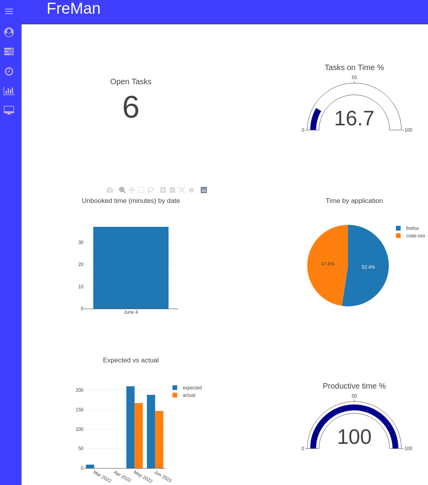
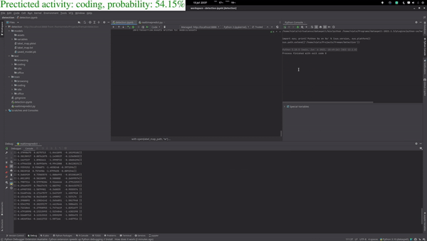

# freman

Track & improve your productivity

Features
* Create tasks with description, estimated duration and deadline
* Mark tasks as completed
* Automatically track time spent coding / browsing / writing
* Book time on tasks
* View reports on your productivity

Example of reporting:  
  

  
  
  
  
Automatic detection of type of activity.  
  

## How to run

Freman consists of three programs, [frontend](https://github.com/orchardpark/freman/tree/master/frontend), [backend](https://github.com/orchardpark/freman/tree/master/backend) and [logger](https://github.com/orchardpark/freman/tree/master/logger). These tools provide the user interface, back-end and logging functionality respectively. Instructions for installing and running these programs can be found in their respective directories.
